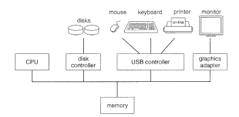

# Part One-overview

## Introduction

an operating system is  a program that manages the computer hardware. It also provide the basis for application programs and acts as an intermediary betwteen the user and the computer hardware

操作系统是 管理计算机硬件的程序,它也为应用程序提供了基础,在用户和计算机硬件中起到 中间媒介的作用
An amazing aspect of operating system is how varied they are in accomplishing these taskes

操作系统令人惊叹的一面 是他们完成这些交互任务的方式 多种多样

Mainframe operating systems are designed primarily to optimize utilization 
of hardware. 

大型主机操作系统 主要为 了优化硬件的使用率 而设计的

Personal computer (PC) operating systems support complex 
games, business applications, and everything in between. 

PC操作系统 提供复杂游戏,商业应用 以及介于两者之间的所有

 Operating systems for handheld computers are designed to provide an environment in which a 
user can easily interface with the computer to execute programs. 

手持电脑的操作系统 旨在提供一种环境,让用户轻松与计算机交互以执行程序

Thus, some 
operating systems are designed to be convenient, others to be efficient, and others 
some combination of the two. 

因此,一些操作系统被设计为方便,其他的被设计为高效,而还有一些则两者特点都有

Before we can explore the details of computer system operation, we need 
to know something about system structure. 

在我们探索计算机系统操作的细节之前,我们需要了解关于系统架构的东西

We begin by discussing the basic 
functions of system startup, I/0, and storage. 

我们先从 系统启动,IO,存储的 基本功能开始讨论

We also describe the basic 
computer architecture that makes it possible to write a functional operating 
system. 

我们同样描述了基本的计算机架构,这些架构使得 写一个功能性的操作系统 成为可能

Because an operating system is large and complex, it must be created 
piece by piece.

因为 一个操作系统是非常庞大且复杂的,它必须一块块创建

 Each of these pieces should be a well-delineated portion of the  system, with carefully defined inputs, outputs, and functions. 

每一块都应是 系统中系统明确描述的部分,带有经过仔细定义了的输入,输出和功能

In this chapter, 
we provide a general overview of the major components of an operating 
system. 

在这个章节中,我们提供了 一个操作系统的主要组成部分的大体上的描述

## CHAPTER OBJECTIVES

章节目标

To provide a grand tour of the major components of operating systems. 

提供一个 对操作系统主要组成部分 的全面介绍

To describe the basic organization of computer systems. 

描述 计算机系统的基本 组成

## 1.1 What Operating System Do

We begin our discussion by looking at the operating system's role in the 
overall computer system.

我们从 研究操作系统在整个 计算机系统中的作用来 开始讨论

 A computer system can be divided roughly into 
four components: the hardware/ the operating system, the application programs/ 
and the users

计算机系统可以大致划分成四个组成部分:硬件/操作系统/应用程序/用户

The hardware- central processing unit,the memory ,and the input/output(I/O) devices provides the basic computing resources for the system.

硬件-CPU,内存,IO设备 提供了基本的计算资源

The application program as word processors/ spreadsheets/ compilers, and Web browsers - define the ways in which these resources are used to solve users' computing problems.

应用程序 例如文档处理器，电子表格,编译器，web浏览器等 定义了 这些资源解决用户的计算问题的方式

The operating system controls the 
hardware and coordinates its use among the various application programs for 
the various users. 

操作系统控制了硬件，为各个用户 协调 各个应用程序的使用

We can also view a computer system as consisting of hardware/ software/ 
and data. 

我们同样可以将计算机 系统 视作 硬件 软件 数据的 组成

The operating system provides the means for proper use of these 
resources in the operation of the computer system.

操作系统 提供了 在操作计算机系统时 的 合理使用资源的方法

An operating system is 
similar to a government. Like a government, it performs no useful function by 
itself. It simply provides an environment within which other programs can do 
useful work. 

操作系统就像一个政府，它本身不起作用，它简单的提供 某种环境，在这种环境下，程序可以有效工作

To understand more fully the operating systemfs role, we next explore 
operating systems from two viewpoints: that of the user and that of the system. 

为了更加全面的理解 操作系统 ，我们接下来从 两个角度 探索操作系统，用户角度，系统角度

### 1.1.1 User View 

The user's view of the computer varies according to the interface being 
used.

计算机的用户视角 根据所使用的接口 各有不同

Most computer users sit in front of a PC, consisting of a monitor/ 
keyboard/ mouse, and system unit. 

大多数人电脑用户 坐在PC前，PC 由 键鼠 以及系统单元 组成

Such a system is designed for one user 
to monopolize its resources. 

这样的系统是为一个用户设计 以独占资源

The goal is to maximize the work (or play) that 
the user is performing. 

它的目标是 使用户正在执行的 工作或游戏最大化

In this case/ the operating system is designed mostly 
for with some attention paid to performance and 

none paid  to various hardware 

and software resources are shared. 

在这上面案例中，操作系统设计的主要关注点放在了性能

而没有关注各种各样的硬件和软件资源的 共享

Performance is, of course, important to the user; but such systems 
are optimized for the single-user experience rather than the requirements of 
multiple users. 

性能当然对用户重要，但是这样的系统为单用的体验户优化 而不是为 多用户的需求

In other cases, a user sits at a terminal connected to a mainframe or a mini-pc
Other users are accessing the same computer through other 
terminals. 

在其他案例，用户坐在终端，连接到一台大型机或者一台mini-PC,其他人通过其他终端访问同样的电脑

These users share resources and may exchange information.

这些使用者 共享资源，可能会交换信息

The operating system in such cases is designed to maximize resource utilization

to assure that all available CPU time, memory, and I/0 are used efficiently and 
that no individual user takes more than her fair share. 

在这样情况的操作系统 旨在 最大化资源的使用 确保所有可能的CPU时间，内存，IO能够被有效的使用，并且 没有人能够获得 比他应得的更多

In still other cases, users sit at connected to networks of 
other workstations and These users have dedicated resources at their 
disposal, but they also share resources such as networking and servers-file, 
compute, and print servers. 

在其他案例中，用户通过网络连接到其他 工作站，这些用户可以使用专用资源

但是他们同样共享资源 例如网络，服务文件，计算，打印服务

Therefore, their operating system is designed to 
compromise between individual usability and resource utilization. 

因此，他们的操作系统设计 为 在 个人使用，和资源利用之间 折中

Recently, many varieties of handheld computers have come into fashion. Most of these devices are standalone units for individual users. 

最近，大多数手持电脑 已经流行，大部分设备是针对 单独的用户  单独的设备

Some are connected to networks, either directly by wire or (more often) through wireless modems and networking. 

这些设备连接到网络， 要么是有线要么是无线解调器和网络连接

Because of power, speed, and interface limitations, they perform relatively few remote operations. 

英文功耗，速度，接口限制，他们执行 相对较少的远程操作

Their operating systems are designed mostly for individual usability, but performance per unit of battery life is important as well. 

他们的操作系统旨在个人使用。但是单位电池寿命同样很重要

Some computers have little or no user view. For example, embedded computers in home devices and automobiles may have numeric keypads and may turn indicator lights on or off to show status, but they and their operating systems are designed primarily to run without user intervention. 

一些计算机 有一点或者 没有 用户界面，例如，家用设备中的嵌入式计算机 和汽车 可能会有数字键盘，可能会打开或关闭指示灯 以展示状态，他们的操作系统旨在 无用户交互运行 

### 1.1.2 System View 

From the computer's point of view, the operating system is the program 
most intimately involved with the hardware. 

从计算机的角度看，操作系统是与硬件最 相近的

In this context, we can view an operating system as a resource allocator. A computer system has many resources that may be required to solve a problem: CPU time, memory space, file-storage space, I/0 devices, and so on. 

在这种情况，我们能把操作系统看做一个资源分配器，计算机系统具有 解决问题 可能需要的很多资源：CPU时间，内存空间，文件存储，IO设备等等

The operating system acts as the manager of these resources. Facing numerous and possibly conflicting requests for resources, the operating system must decide how to allocate them to specific programs and users so that it can operate the computer system efficiently and fairly. 

操作系统 扮演着 这些资源的管理，面对大量可能的冲突的资源请求，操作系统必须决定如何分配资源给 特定的程序与用户，使得操作系统能够操作 系统公平有效

As we have seen, resource allocation is especially important where many 
users access the same mainframe or minicomputer. 

正如同我们看见的，当多用户访问同一台大型机或者mini-PC 时，资源分配尤其重要

A slightly different view of an operating system emphasizes the need to 
control the various I/0 devices and user programs. 

操作系统的视图（与用户视图）略有 不同，它强调需要控制IO设备和用户程序

An operating system is a control program. A control program manages the execution of user programs to prevent errors and improper use of the computer. 

有个操作系统是一个控制程序，一个控制程序管理用户程序的执行，以避免错误和不恰当的使用

It is especially concerned with the operation and control of I/O devices. 

尤其要关注 IO设备的操作和控制

### 1.1.3 Defining Operating Systems 

定义操作系统

We have looked at the operating system's role from the views of the user 
and of the system. 

我们已经从用户和系统角度研究了操作系统的作用

How, though, can we define what an operating system is? 

但是如何才能定义操作系统是什么

In general, we have no completely adequate definition of an operating 
system.

总之，我们没有对操作系统有充足的定义

Operating systems exist because they offer a reasonable way to solve 
the problem of creating a usable computing system. 

操作系统的存在 是因为他们提供了一个合理的方式，解决 了 如何创建一个可用计算系统的 问题

The fundamental goal of computer systems is to execute user programs and to make solving user

计算机系统的基本目标 是执行用户程序，解决用户问题

STORAGE DEFINITIONS AND NOTATION 

存储定义与符号

A bit is the basic unit of computer storage. It can contain one of two values, zero and one. All other storage in a computer is based on collections of bits. 

一个bit是 计算机存储 的基本单位，它能够有两个值，0,1 所有其他计算机的存储 基于bit位的集合

Given enough bits, it is amazing how many things a computer can represent: 
numbers, letters, images, movies, sounds, documents, and programs, to name 
a few. 

只要有足够的bit位，令人惊讶的是 计算机可以表示 多少东西：numbers, letters, images, movies, sounds, documents, and programs ，仅仅举几例

A byte is 8 bits, and on most computers it is the smallest convenient 
chunk of storage. 

1byte 是 8 bits, 在 大多数计算机 这是最小的最方便的存储块

For example, most computers don't have an instruction to move a bit but do have one to move a byte. A less common term is word which is a given computer architecture's native storage unit. 

例如，大多数计算机没有 操作位的指令只有字节操作的指令，更少见得术语 是 word，这是给定计算机架构 本地存储单元

A word is  generally made up of one or more bytes. For example, a computer may have 
instructions to move 64-bit (8-byte) words. A kilobyte, or KB, is 1,024 bytes; a megabyte, or MB, is 1,0242 bytes; and a gigabyte, or GB, is 1,0243 bytes. Computer manufacturers often round off these numbers and say that a megabyte is 1 million bytes and a gigabyte is 1 billion bytes. 
problems easier. 

一个单词 大致由一个或者多个单词组成，例如，一个计算机可能有指令操作 64位（8个字节)单词，

Toward this goal, computer hardware is constructed.

为了达到这个目标，计算机硬件 被构建了

Since bare hardware alone is not particularly easy to use, application programs are developed. 

由于裸硬件 并不是特别容易使用，于是应用程序被开发出来

These programs require certain common operations, such as those 
controlling the IO devices. 

这些程序需要某些通用操作，比如IO设备的控制

The common functions of controlling and allocating 
resources are then brought together into one piece of software: the operating 
system. 

资源控制和分配的通用功能被整合到一个软件中,这个软件就是操作系统

In addition, we have no universally accepted definition of what is part of the 
operating system.

另外，关于操作系统的组成  我们还没有统一被认可的定义，

 A simple viewpoint is that it includes everything a vendor ships when you order "the operating system." The features included, however, vary greatly across systems. 

一个简单的观点 是，当你订购一个操作系统时，操作系统包括供应商提供的一切

其中包含的功能在系统之间 差异很大

Some systems take up less than 1 megabyte of space and lack even a full-screen editor, whereas others require gigabytes of space and are entirely based on graphical windowing systems. 

一些系统 占用不到 1M的空间，甚至没有全屏编辑器，然而其他系统需要 GB级的空间，且完全基于图形界面

A more common definition, and the one that we usually follow, is that the operating system is the one program running at all times on the computer-usually called 
the kernel. 

一个更加常见的定义 也是我们通常遵循的定义 操作系统 是一个始终运行的通常电脑的程序 通常叫做 内核

(Along with the kernel, there are two other types of programs: 
which are associated with the operating system but are not 
part of the kernel, and which include all programs not 
associated with the operation of the system.) 

(与内核一起的,通常有两种类型的程序,与操作系统相关的,但是不是内核的一部分,另外一种是 所有与操作系统无关的进程)

The matter of what constitutes an operating system has become increasingly important. 

是什么构成操作系统 这个问题越来越重要

In 1998, the United States Department of Justice filed suit against Microsoft, in essence claiming that Microsoft included too much functionality in its operating systems and thus prevented application vendors from 
competing.

在1998年,美国司法部 向微软提起诉讼,大致宣称微软包含太多功能在它的操作系统,这阻止了应用程序供应商参与竞争

For example, a Web browser was an integral part of the operating 
systems. As a result, Microsoft was found guilty of using its operating-system 
monopoly to limit competition. 

例如,网页浏览器是操作系统集成部分,因此,微软被认定位有罪,在利用操作系统垄断以此来限制竞争

## 1.2 Computer System Organization

Before we can explore the details of how computer systems operate, we need general knowledge of the structure of a computer system.

在我们探讨操作系统如何运作之前,我们需要对计算机系统的结构有大致的了解

### THE STUDY OF OPERATING SYSTEMS 

there has never been a more interesting time  to study operating system and it has never been easier

从未有比现在更有趣的时间去学习操作系统,也从未如此简单

the open-source movement has overtaken the operating systems,casuing many of them to be made available in source  and binaries (executable) format

开源运动 占领了 操作系统,使得其中的很多操作系统的源代码和二进制执行文件 可获得

This list includes Linux,BSD UNIX,Solaris and part of MacOSX.The availability of source code allows us to study operating system from inside out. Question that previously could only be answered by looking at documentation or the behaviour of the operating system can now be answered by examining the code itself

其中包括 Linux,BSD UNIX,Solaris,部分MacOSX,源代码的开放使得我们从内向外学习操作系统,之前只能通过 看文档,或者看操作系统的行为 来解答的问题,现在能够通过检查代码本身来解答了

In addition,The rise of virtualization as a mainstream computer function makes it possible to run many operating systems on top of one core system.For example,VMware provides a free "player" on which hundreds of virtual appliances can run.

另外,虚拟化作为主流计算机的功能 的流行 使得在单核系统上运行多个操作系统成为可能,例如,VMware 提供免费"player" ,数百个免费的虚拟程序能够运行在上面.

Using This method,student can try out hundres of operating systems within their existing operating system at no cost

使用这个手段,学生能够 利用现有的操作系统 无成本的实验上百个操作系统,

Operating-System that are no longer commercially viable have been open-sourced as well,enabling us to study how system operated in a time of fewer CPU,memory, and storage resources

不在具有商业可行性的 操作系统 现在也已经开源了,使我们能够学习系统如何 在较少的CPU内存,存储资源 情况下操作

An extensive but not complete list of open-source operating system projects is available from httpUrl

一个大量的但不完整的开源操作系统项目的清单可以从 http://domz.org/computers/software/operating_systems/open_source/获得

Simulators of specific hardware are also  available in some cases ，allowing operating system run on “native” hardware,all within the confines of a modern computer and modern operating system

特定硬件的模拟器同样在某些情况 可以(从上述网站上)获得，允许操作系统运行在本地硬件，所有的都在现代计算机 现代操作系统的范围内

The advent of open-source operating system also makes it easy to make the move from student to operating system developer

开源操作系统的出现 也使得 从学生到操作系统开发者 这种改变 更简单.

With some knowledge ,some  effort ,an  Internet  connection ,An  student  can  even create a  new operating-system  distribution .Just a few years ago ,it  is difficult or impossible to access   code . Now that access is limited only by how much time and disk space as student has

一些知识，一些努力，一个Internet连接，一个学生甚至能创建一个新的操作系统发行版本，就在几年前，访问源代码很困难或者不可能，现在限制学生的是他的时间和磁盘空间

with computer-system organization, so you can skim or skip it if you already
understand the concepts.

计算机系统的组织，如果你已经理解了概念了，你可以略读或者跳过

### 1.2.1 Computer-System Operation

A modern general-purpose computer system consists of one or more CPUS and a number of device controllers connected  through a common bus that provides access to shared memory . Each device controller  is in charge of a specific type of device(for example disk drivers,audio device ,video display ) CPU and device controllers can execute concurrently,competing for memory cycles . To ensure orderly access to shared memory,a  memory controller is provided whose function is to synchronize access to the memory 

现代通用计算机包含一个或者多个CPU，大量 设备控制器，直连 可以提供共享内存访问的 地址总线，每一个设备控制器负责一种类型的设备（例如，磁盘驱动，音频设备，视频显示）。CPU与设备控制器能够并发执行，参与内存周期的竞争，为了确保有序的访问共享内存，需要内存控制器的 同步访问内存的 功能

For a computer to start running - for instance ,when it is powered up  or rebooted ,it  needs to have an initial program to run. This initial program  or bootstrap program  tends to be simple ,Typically ,it is stored in ROM  or  EEPROM , known by the general term  firmware within the computer hardware . It initializes all aspects of system from CPU registers to device controllers to memory contents .the bootstrap program must know how to load system and  how to start executing that system .To accomplish this goal ,the bootstrap program must locate and load into memory the operating-system kernel .The operating system then starts executing the first progress such as "init" and waits for some event to occur.

拿计算机开始启动为例，当计算机开机或者重启时，它需要有一个初始化程序运行。这个初始化程序 或者 引导程序 往往很简单，特别的地方是它存储在 ROM里或者EEPROM中，常用术语也称之为 计算机硬件内的固件，它初始化了系统的所有方面，从CPU寄存器到 设备控制器 到内存内容。引导程序必须知道如何载入操作系统，如何开始执行系统。为了完成这个目标，引导程序必须 找到操作系统内核并载入内存。操作系统然后开始执行第一个进程，例如“init” ，并等待某些事件发生

The occurrence of an event is usually signaled by an interrupt from either the hardware or the software . Hardware may trigger an  interrupt at any time by sending a signal to the CPU,usually by way of system bus . Software may trigger an interrupt by executing a special operation called a system call 

事件的发生通常是来自硬件或者软件的中断。硬件可能会随时 通过发送给CPU一个信号 来触发中断，通常会经过系统总线。软件可能会 通过执行特殊的操作 叫做 系统调用 触发中断

when  CPU  is  interrupted , it  stops what is  doing and  immediately transfer execution to a fixed location .The fixed location usually contains a starting address where the service routine for the interrupt is located. The interrupt service routine executes . On completion ,the CPU resumes the  interrupted computation

当CPU被打断了，它会停止当前所做的事情，立马切换到一个固定的位置执行，固定的位置通常包含了 中断服务例程 所处的起始地址，中断服务例程 执行。完成后 CPU恢复被中断的计算

Interrupts  are  an important part of a computer architecture . Each computer design has its own interrupt mechanism ,but several functions are common .The interrupt must transfer control to the appropriate interrupt service routine .The straightforward method for handling this transfer would be to invoke a generic routine to examine interrupt information . The interrupt routine  , in turn , would call the interrupt-specific handler. However interrupts must be handled quickly . Since only a predefined number of interrupts is possible , a table of pointers to interrupt routines can be used  instead to provide  necessary speed . the interrupt routine is called indirectly  through the table with no intermediate routine needed .Generally,table of pointers is stored in slow memory (the first hundred or so locations). These locations hold the addresses of various interrupt service routine . This array ,or interrupt vector of addresses is then  indexed by the unique device number ,given the interrupt request ,to provide the address of the interrupt service routine  for the interrupting device . 

中断是计算机架构的 重要组成部分，每个计算机设计有他的自己的中断机制，但是有几个功能是类似的。中断必须将控制权转移给合适的中断服务例程。处理转移直接的方法可能是执行一个通用例程 去测试 中断信息。中断例程 会依次 调用特定中断处理器。但是中断必须快速处理。因为只有一定 预定义的 数量的中断，可以给中断例程使用指针表提供必要的速度。中断例程通过指针表非直接调用，无需中间例程。大致上指针表存储在内存低地址（前一百个位置）。这些位置 保留各种各样的中断服务例程的地址。然后在给定中断请求中，这个地址数组，或者地址中断向量 由唯一设备号索引，为中断设备提供中断服务程序的地址。

