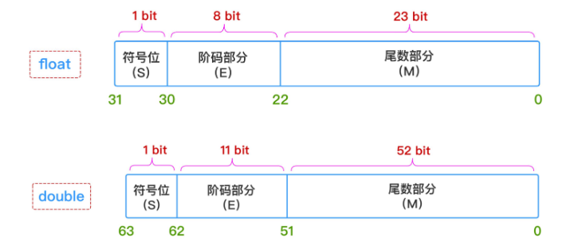

# 浮点数的组成

* 浮点数的组成遵循 IEEE 754计数标准 可以用科学计数法表示
  $$
  s 1.M * 2^E
  $$
  

* s表示符号，M表示尾数，E表示阶码

* 


# 3.89 用 浮点数表示 


$$
转化为二进制为\\
0.89 \approx
1/(1<<1) +1/(1<<2) + 1/(1<<3) + \\
1/(1<<7) + 1/(1<<8) + 1/(1<<9) + 1/(1<<10) +\\
1/(1<<12) + 1/(1<<14) + 1/(1<<15) + 1/(1<<16) +\\
1/(1<<21) + 1/(1<<22)\\
(3.89)_{10} \approx (11.1110 0011 1101 0111 0000 11)_{2}\\
浮点表示（一般对指数部分+127，便于浮点之间比较计算）\\
0\qquad 10000000\qquad 11110001111010111000011\\
浮点十六进制表示\\
0100\quad 0000\quad 0111\quad 1000\quad 1111\quad 0101\quad 1100\quad 0011\\
0x4078F5C3
$$


# C语言验证代码

```C
int main(int argc, char const *argv[])
{
    float f = 3.89f; 
    printf("%#x\n",*(int *)&f);
    return 0;
}
```

# 浮点数 最大值

* 浮点值定义 `float.h`

 `#define FLT_MAX         3.402823466e+38F        /* max value */`
$$
最大值\\
(0\quad1111\ 1110\quad 1111\ 1111\ 1111\ 1111\ 1111\ 111 \\)_{2}\\
(0X7F7F\ FFFF)_{16}\\
Infinity值 (当阶码全为1时)\\
(0\quad1111\ 1111\quad 1111\ 1111\ 1111\ 1111\ 1111\ 111 \\)_{2}\\
(0X7FFF\ FFFF)_{16}\\
$$
